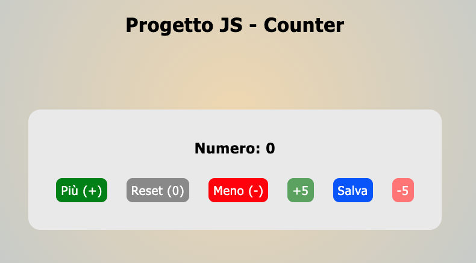
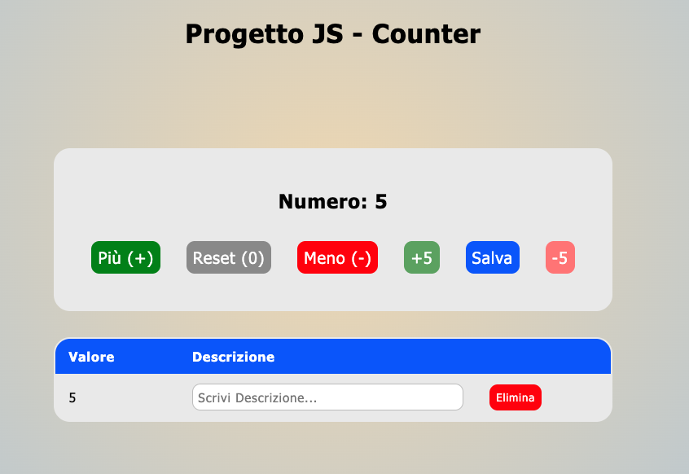

# ⏱️ Progetto JS - Counter

Questo è un semplice contatore realizzato con JavaScript, che permette di incrementare, decrementare e resettare un valore numerico dinamicamente.
Grazie a questo "Counter" potrai contare qualsiasi cosa tu voglia: click, squat, bugie dette ecc..

Progetto effettuato per il test finale della sezione JavaScript di Start 2 Impact

## 📸 Anteprima

**Contatore: stato iniziale**

---

**Contatore: tabella salvataggi valori**

## 💻Funzionalità

- Incrementa il contatore con il pulsante "+"
- Incrementa il contatore di 5 con il pulsante "+ 5"
- Decrementa il contatore con il pulsante "-"
- Decrementa il contatore di 5 con il pulsante "- 5"
- Reset del contatore a zero
- Salvataggio del valore corrente in una tabella dinamica
- Aggiunta di una Descrizione testuale ad ogni valore salvato
- Possibilità di rimozione di ogni valore salvato
- Rimozione automatica della tabella se non ci sono più valori salvati

## 🧩 Prova il Contatore Online

[Clicca qui per provare il **Contatore**](https://chrigiaccardi.github.io/Project-Counter-JS/)

## 🛠️ Tecnologie usate

- HTML dinamico generato tramite script
- CSS per lo stile
- JavaScript (DOM manipulation)

## 🔗 Autore - Link
Christian Giaccardi - [chrigiaccardi@gmail.com](mailto:chrigiaccardi@gmail.com)
GitHub [GitHub](https://github.com/chrigiaccardi)

---

Mi puoi trovare anche su [LinkedIn](https://it.linkedin.com/in/christian-giaccardi-753085180?trk=public_profile_browsemap_profile-result-card_result-card_full-click) e [Instagram](https://www.instagram.com/chrigiaccardi/)

