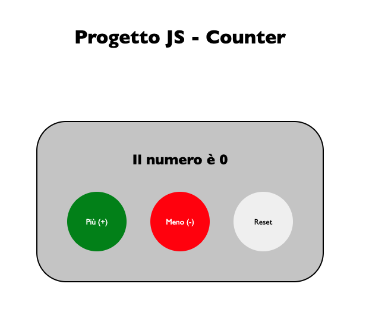

# Progetto JS - Counter

Questo è un semplice contatore realizzato con JavaScript, che permette di incrementare, decrementare e resettare un valore numerico dinamicamente.
Progetto effettuato per il test finale della sezione JavaScript di Start 2 Impact

## Funzionalità

- Incrementa il contatore con il pulsante "+"
- Decrementa il contatore con il pulsante "-"
- Reset del contatore a zero

## Tecnologie usate

- JavaScript (DOM manipulation)
- HTML dinamico generato tramite script
- CSS per lo stile

## Meta
Christian Giaccardi - [chrigiaccardi@gmail.com](mailto:chrigiaccardi@gmail.com)
Mi puoi trovare su [LinkedIn](https://it.linkedin.com/in/christian-giaccardi-753085180?trk=public_profile_browsemap_profile-result-card_result-card_full-click) e [Instagram](https://www.instagram.com/chrigiaccardi/)

